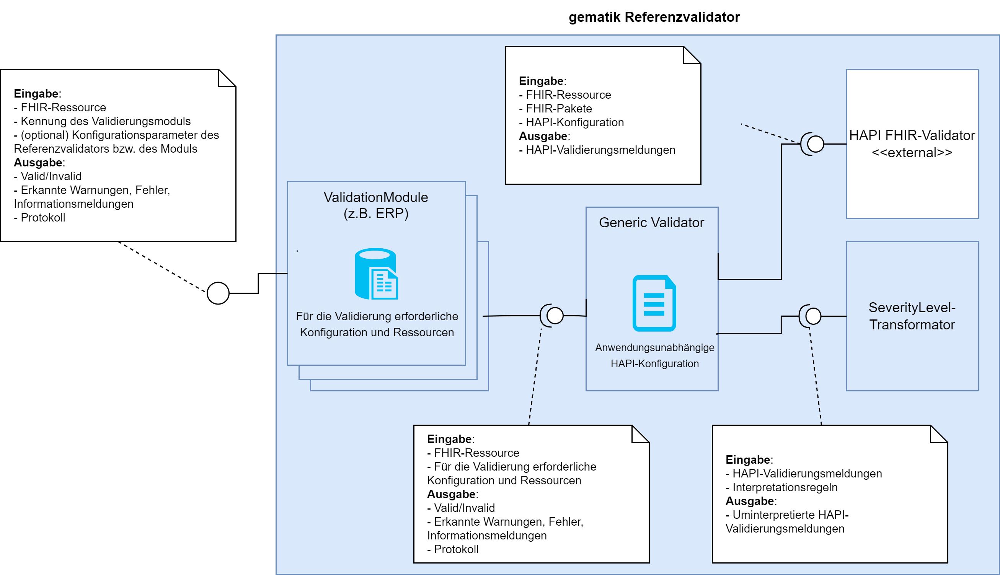

Einführung und Zielsetzung
==========================
Im Kontext der Einführung des elektronischen Rezepts (E-Rezept) kristallisiert sich heraus, dass die Interoperabilität von beteiligten Informationssystemen und formale Korrektheit von übertragenen Daten über die gesamte Prozesskette hinweg unabdingbar ist. Die sich hieraus ergebende Validität erstreckt sich über das E-Rezept hinaus auch auf weitere Anwendungen innerhalb der Telematikinfrastruktur (z.B. eAU). Es ist bereits heute absehbar, dass aktuelle bzw. künftige Projekte innerhalb der Telematikinfrastruktur valide Datensätze benötigen. Leider gestaltet sich die Erstellung und Überprüfung von validen Datensätzen auf FHIR-Basis heute schwierig, weil:

*   FHIR-Profile nicht immer vollständig die zugrundeliegenden Informationsmodelle abbilden
*   FHIR-Profile Konstrukte verwenden, die von Validierungswerkzeugen unterschiedlich interpretiert werden
*   Die Tiefe der sinnvollen Überprüfung (FHIR-Profile referenzieren (rekursiv) weitere Profile, ValueSets, Kataloge etc.) ist für die beteiligten Systeme nicht einheitlich festgelegt
*   Die Abweichungen von Profilen, die von Validierungswerkzeugen als Warnungen festgestellt werden, aktuell unzureichend und nicht einheitlich bei der Validitätsentscheidung berücksichtigt werden.
*   FHIR-Profilversionen mit der Zeit ablaufen und durch neue im Sinne der Anwendung gültigen Versionen ersetzt werden.

Aufgrund dessen besteht Bedarf für die TI-Anwendungen die Validierungsregeln über die Systeme hinweg festzuschreiben und eine Prüfinstanz in Form eines Referenzvalidators bereitzustellen, die diese Regeln auch als Referenz umsetzt.

Begriffsdefinition
==================

Der **gematik** **Referenzvalidator** ist ein Softwarewerkzeug, das die im Rahmen von TI-Anwendung verarbeiteten FHIR-Ressourcen auf ihre "technische Verarbeitbarkeit" hin überprüft. Der Begriff der "technischen Verarbeitbarkeit" kann sich je nach TI-Anwendung unterscheiden, mindestens liegen aber folgende Voraussetzungen zugrunde:

*   Die FHIR-Ressourcen sind konform zu den referenzierten Profilen bzw. Profilversionen
*   Die referenzierten Profile bzw. Profilversionen sind zum Zeitpunkt der Erstellung der Ressource gültig und wurden nicht durch neuere Profile bzw. Profilversionen abgelöst.

Die wichtigsten Verarbeitungskomponenten des Referenzvalidators werden **Prüfmodule** sein. Diese kapseln alle Daten, die für die Validierung von FHIR-Instanzen im Rahmen einer TI-Anwendung erforderlich sind (verwendete Profile, Profilversionen, Pakete, Konfiguration der zugrundeliegenden Validierungsbibliothek etc.).

Nutzungsszenarien E-Rezept-Prüfmodul
====================================

Entwicklungsunterstützung
-------------------------

Ein Primärsystemhersteller-Hersteller möchte bereits während der Implementierung des E-Rezept-Moduls die Validität von seinen zu Testzwecken erzeugten VO-Datensätzen überprüfen. Zu diesem Zweck verwendet er den Referenzvalidator als Stand-alone-Konsolenanwendung und prüft die aus seinem System erzeugten Dateien auf Korrektheit.

Schiedsrichter-Szenario
-----------------------

Ein empfangendes System A weist einen E-Rezept-Datensatz aufgrund der fehlenden Konformität zu gültigen FHIR-Profilen ab. Das sendende System B nimmt bei der Problemanalyse den Referenzvalidator um festzustellen, ob die gesendete Ressource tatsächlich invalide ist. Der Datensatz wird als Datei über die Kommandozeile an den Referenzvalidator zur Prüfung übergeben. Je nach dem "Urteil" des Referenzvalidators, wird entweder die Implementierung eines im Prozess beteiligten Systems korrigiert um zukünftig valide Datensätze zu erzeugen, oder die Abweisung des Datensatzes angefochten.

Bestätigungsverfahren der gematik
---------------------------------

Im Rahmen der Bestätigungsverfahren der gematik können sich die Primärsysteme einer Reihe von Tests unterziehen, die die grundsätzliche Kompatibilität ihrer Umsetzung zur Spezifikation einer TI-Anwendung für Client-Systeme überprüfen. Der Referenzvalidator wird in die Bestätigungsplattform integriert, um alle eingehenden FHIR-Ressourcen auf ihre technische Validität im Sinne der jeweiligen TI-Anwendung zu überprüfen. Mit diesen Überprüfungen wird sichergestellt, dass die Primärsysteme zumindest im Rahmen der Bestätigungstests im Stande waren technisch valide Datensätze zu erzeugen.

Echtzeitvalidierung von FHIR-Datensätzen
----------------------------------------------------------------

Ein Apothekenrechenzentrum muss wissen, ob ein E-Rezept den technischen Verarbeitungsanforderungen entspricht, um entscheiden zu können, ob das Rezept zur Weiterverarbeitung / Weiterleitung an Krankenkassen-Annahmestellen angenommen, abgewiesen oder korrigiert werden soll. Für diesen Zweck wird der Referenzvalidator in eine bestehende Anwendung als Bibliothek oder als externe Anwendung mit Standard Ein-Ausgabe-Schnittstelle integriert. Die zu validierenden FHIR-Instanzen werden an den Referenzvalidator weitergereicht und die Ergebnisse der Validierung von der Anwendung automatisiert ausgewertet.

> **Warning**
> Der Betrieb des Referenzvalidators in bestehenden Anwendungen oder Anwendungslandschaften obliegt der Verantwortung der Nutzer. Die gematik trifft angemessene Maßnahmen, um die Sicherheit und Performance des Referenzvalidators zu gewährleisten. Sie übernimmt aber keine Verantwortung für etwaige Schäden, die durch die Integration des Referenzvalidators in Produktionssysteme entstehen (siehe auch Haftungsausschuss der [Apache 2.0-Lizenz](https://www.apache.org/licenses/LICENSE-2.0). Insbesondere müssen die Sicherheitsaspekte des Gesamtsystems unter Einbeziehung der technischen und organisatorischen Rahmenbedingungen der jeweiligen Betriebsumgebung durch die Nutzer selbst bewertet werden. Des Weiteren hängen die Performance-Eigenschaften des Validators stark von der jeweiligen Betriebsumgebung ab.

Weiterentwicklung der Profile
-----------------------------

Eine Organisation, die mit Profilierung von E-Rezept-Ressourcen beauftragt ist, entwickelt die Profildefinitionen kontinuierlich weiter. Zur Prüfung der Validität der neuen Profile und der neuen Beispieldatensätze, wird der Referenzvalidator hinzugezogen. Dieser wird entweder manuell auf neuen Profilen und Beispieldatensätzen aufgerufen oder in die CI-Pipelines integriert.

E-Rezept: Nutzung- und Stakeholderanforderungen an den Referenzvalidator
========================================================================

<table class="wrapped confluenceTable" style="letter-spacing: 0.0px;">
    <colgroup>
        <col style="width: 29.0px;">
        <col style="width: 430.0px;">
        <col style="width: 337.0px;">
        <col style="width: 344.0px;">
    </colgroup>
    <tbody>
    <tr>
        <th class="confluenceTh" colspan="1"> </th>
        <th class="confluenceTh">Erfordernisse</th>
        <th class="confluenceTh">Nutzung- und Stakeholderanforderungen</th>
        <th class="confluenceTh" colspan="1">Systemanforderungen</th>
    </tr>
    <tr>
        <td class="confluenceTd" colspan="1">1</td>
        <td class="confluenceTd">
Ein<strong> Entwickler vom PVS/KIS-, AVS-, Apothekenrechenzentrum-,
            Annahmestellen-Software, E-Rezept-App</strong> muss ein Werkzeug verfügbar haben, mit dem FHIR-Ressourcen,
            die bei E-Rezepten zum Einsatz kommen, gegen gültige FHIR-Profile/Profilversionen validiert werden können
            (aktuell gültige oder demnächst gültige). Damit soll die Qualitätssicherung der Anpassungen an
            E-Rezept-Modulen unterstützt werden.
</td>
        <td class="confluenceTd">
1.1. Der Entwickler muss bei dem Referenzvalidator die zu validierende
            FHIR-Ressource aus der TI-Anwendung E-Rezept eingeben können.

            
1.2. Der Entwickler muss an dem Referenzvalidator das binäre Ergebnis der Validierung erkennen können.
                Falls das Ergebnis der Validierung negativ sein sollte, muss der Entwickler an den Ausgaben des Referenzvalidators die erkannten Verletzungen der FHIR-Profile eindeutig erkennen können.
            

            
1.3 Der Benutzer muss bei dem Referenzvalidator eine zu validierende FHIR-Ressource eingeben können, die
                FHIR-Profilversionen referenziert, die zwar schon veröffentlicht wurden, die aber noch nicht gültig
                sind.
</td>
        <td class="confluenceTd" colspan="1">
            

1.1.1. Der Referenzvalidator muss Instanzen aller im Kontext von E-Rezept definierten Profile als Eingabe akzeptieren können.

                
1.2.1. Der Referenzvalidator muss Zugriff auf für die Validierung erforderlichen FHIR-Pakete und Ressourcen sowie Gültigkeitszeiträume der Profile, Profilversionen, FHIR-Pakete und Ressourcen haben (siehe <a
                        class="external-link"
                        href="https://github.com/gematik/api-erp/blob/master/docs/erp_fhirversion.adoc" rel="nofollow" target="_blank">Profil-Roadmap</a>). Insbesondere sollen die im Kontext von E-Rezept eingesetzten <a href="https://applications.kbv.de/overview.xhtml" target="_blank">Schlüsseltabellen der KBV</a> sowie deren Gültigkeitszeiträume und Release-Zyklen berücksichtigt werden. 
                    

                
1.2.2. Das E-Rezept muss als Ergebnis eine Valid / Invalid-Antwort und als Ergänzung weitere eventuell erkannte Konformitätsprobleme ausgeben können.

                
1.2.3. Um die Valid / Invalid-Antwort zu produzieren, muss der Referenzvalidator die <a href="#validation-configuration">Validierung-Konfiguration</a> und <a href="#result-interpretation">Interpretationsregeln</a> anwenden. 

                
1.2.4. Der Referenzvalidator kann als Startparameter eine unterstützte Profil-URL akzeptieren, um die Konformität der eingegebenen Instanz zu dem zugrundeliegenden Profil zu überprüfen.

                
1.3.1. Der Referenzvalidator
                    muss Zugriff auf die bereits veröffentlichten aber potenziell noch nicht verpflichtend geltenden
                    FHIR-Pakete haben (siehe <a class="external-link"
                                                                 href="https://github.com/gematik/api-erp/blob/master/docs/erp_fhirversion.adoc"
                                                                 rel="nofollow" target="_blank">Profil-Roadmap</a>) 

                
1.3.2. Als Referenzzeitpunkt zur Gültigkeitsprüfung von referenzierten Profilversionen sollen die <a href="#creation-date-elements">Erstellung-Datumsangaben aus
                    der FHIR-Ressource</a> dienen
 
                
1.3.3.<b>*</b> Der Referenzvalidator kann als Startparameter einen Referenzzeitpunkt akzeptieren, der anstatt der in
                    der Nachricht angegebenen Datumsangabe, zur Bestimmung der zum Zeitpunkt gültigen FHIR-Profilversion
                    verwendet werden soll. (siehe Use Case Bestätigungsverfahren)

                

                
1.3.4.<b>*</b> Der Referenzvalidator kann mittels eines
                    Startparameters auch FHIR-Core-Ressourcen validieren, die keine explizite Profilangabe aufweisen (z.B. 
                    Parameters).

                
1.3.5. Der Referenzvalidator kann als Startparameter die zu unterstützenden Instanzformate (XML und/oder JSON) akzeptieren. Standardmäßig soll nur XML akzeptiert werden.

                
1.3.6. Die Zeitraum-Gültigkeitsprüfung der Profilversionen kann bei Bedarf mit einem Startparameter abgeschaltet werden.

                

        </td>
    </tr>
    <tr>
        <td class="confluenceTd" colspan="1">2</td>
        <td class="confluenceTd" colspan="1">
Ein <strong>Apothekenrechenzentrum </strong>oder eine <strong>KK-Annahmestelle</strong>
            müssen im Konfliktfall wissen, ob ein vor maximal 2 Jahren erstellter
            und als technisch invalider bewerteter und abgewiesener E-Rezept-Datensatz den zum Erstellungszeitpunkt
            geltenden FHIR-Profilversionen entsprach, um die Abweisung ggf. neu bewerten zu können.
</td>
        <td class="confluenceTd" colspan="1">
2.1 Der Benutzer muss bei dem Referenzvalidator die zu validierende
            E-Rezept-FHIR-Ressource, die maximal vor 2 Jahren erstellt wurde, eingeben können.

            
 
</td>
        <td class="confluenceTd" colspan="1">
            

2.1.1. Der Referenzvalidator muss FHIR-Ressourcen, deren Ausstellungsdatum
               2 Jahre zurückliegen kann, als Eingabe akzeptieren können (siehe <a href="#creation-date-elements">Profil-Elemente zur Bestimmung des Instanz-Erstellungszeitpunktes</a>).
            

                
2.1.2. Der Referenzvalidator muss Zugriff auf für die Validierung erforderlichen FHIR-Pakete und Ressourcen sowie Gültigkeitszeiträume der Profile, Profilversionen, FHIR-Pakete und Ressourcen der letzten 2 Jahre haben
                

                

        </td>
    </tr>
    <tr>
        <td class="confluenceTd" colspan="1">3</td>
        <td class="confluenceTd" colspan="1">
Ein <strong>Apotheken-Rechen-Zentrum </strong>oder eine <strong>KK-Annahmestelle</strong>
            muss einen Referenzvalidator verfügbar haben, um FHIR-Ressourcen im laufenden Betrieb automatisiert validieren zu können.
</td>
        <td class="confluenceTd" colspan="1">
 
</td>
        <td class="confluenceTd" colspan="1">
            

3.1.1 Der Referenzvalidator muss als Open Source bereitgestellt werden.
                

                
3.1.2. Der Referenzvalidator muss als Java 11-Bibliothek und als Konsolenanwendung bereitgestellt
                    werden, damit die Integration in andere Anwendungen möglich wird.
 
            

        </td>
    </tr>
    </tbody>
</table>

Die mit <b>*</b> gekennzeichneten Anforderungen sind noch nicht umgesetzt. 

> **Warning**
> Sämtliche Startparameter des Referenzvalidators dienen nur zur Unterstützung der Qualitätssicherungsszenarien. Für das [Schiedsrichter-Szenario](#e-rezept-technische-verarbeitbarkeit-schiedsrichter-rolle-und-problemlösungsverfahren) dürfen keine Startparameter verwendet werden, da sie sonst das Verhalten und die Ausgaben des Referenzvalidators verfälschen.  

Anzuwendende Validierungskonfiguration
-----------------------------------------------------------------

<table id="validation-configuration">
<tr>
<th>Konfigurationselement</th>
<th>Wert</th>
<th>Anmerkung</th>
</tr>
<tr>
<td>Unbekannte Profile in den Instanzen führen zu Fehlern</td>
<td>ja</td>
<td></td>
</tr>
<tr>
<td>Unbekannte Erweiterungen (Extensions) führen zu Fehlern</td>
<td>ja</td>
<td></td>
</tr>
<tr>
<td>Code-Systeme und ValueSets, die nicht validiert werden</td>
<td>
<ul>
<li>http://fhir.de/CodeSystem/ifa/pzn</li>
<li>http://fhir.de/CodeSystem/ask</li>
</ul></td>
<td></td>
</tr>
<tr>
<td>Referenzierte ValueSets, für die eine Definition fehlt, führt zu Fehlern</td>
<td>ja</td>
<td></td>
</tr>
<tr>
<td>Nicht auflösbare Querreferenzen in Bundles, führen zu Fehlern</td>
<td>nein</td>
<td>Der Fehler tritt auf, falls die in einem Bundle verwendeten Referenzen sich nach dem [Algorithmus aus der FHIR-Spezifikation](https://hl7.org/fhir/R4B/bundle.html#references) nicht auflösen lassen. 

Diese Regel führt zu keinem Fehler, damit die Kompatibilität zu ABDA Referenzvalidator und der aktuellen Implementierung vom E-Rezept-Fachdienst erhalten bleibt. Allerdings kann das Ignorieren von nicht auflösbaren Querreferenzen in Bundles dazu führen, dass bestimmte Fehlsituationen vom Validator nicht erkannt bleiben, bspw. wenn das Ziel einer lokalen Referenz im Bundle nicht auftaucht oder ihr Typ mit den targetType-Vorgaben nicht übereinstimmt. Das Risiko von solchen Fehlsituationen wird allerdings durch die Profil-Contraints in den aktuellen Profilen deutlich minimiert.</td>
</tr>

</table>

Anzuwendende Ergebnis-Interpretationsregeln
-----------------------------------------------------------------
<table id="result-interpretation">
<tr>
<th>Package</th>
<th>Regel</th>
<th>Anmerkung</th>
</tr>
<tr>
<td>de.abda.erezeptabgabedaten-1.0.3.tgz</td>
<td>Folgende HAPI-Ausgaben werden als INFO statt als ERROR-Nachrichten gewertet:
<ul>
<li>MessageId: _DT_Fixed_Wrong. Diagnostics enthält: 'http://fhir.abda.de/Identifier/DAV-Herstellerschluessel' but must be 'http://fhir.de/NamingSystem/arge-ik/iknr'</li>
<li>MessageId: Reference_REF_CantMatchChoice. Diagnostics enthält: http://fhir.abda.de/eRezeptAbgabedaten/StructureDefinition/DAV-PR-ERP-ZusatzdatenEinheit</li>
<li>MessageId: Reference_REF_CantMatchChoice. Diagnostics enthält: http://fhir.abda.de/eRezeptAbgabedaten/StructureDefinition/DAV-PR-ERP-ZusatzdatenHerstellung</li>
<li>MessageId: Reference_REF_CantMatchChoice. Diagnostics enthält: http://fhir.abda.de/eRezeptAbgabedaten/StructureDefinition/DAV-PR-Base-ZusatzdatenHerstellung</li>
<li>MessageId: Validation_VAL_Profile_NotSlice. Diagnostics enthält: http://fhir.abda.de/eRezeptAbgabedaten/StructureDefinition/DAV-PR-ERP-ZusatzdatenEinheit</li>
</ul>
</td>
<td>Die Interpretationsregel kam infolge eines Profilierungsfehlers zustande</td>
</tr>
</table>

Profil-Elemente zur Bestimmung des Instanz-Erstellungszeitpunktes
-----------------------------------------------------------------
<table id="creation-date-elements">
    <tr>
        <th>Profil</th>
        <th>Datenelement</th>
        <th>Anmerkung</th>
    </tr>
    <tr>
        <td>KBV_PR_ERP_Bundle</td>
        <td>MedicationRequest.authoredOn bzw. SupplyRequest.authoredOn</td>
        <td>Verordnung, Datum der Ausstellung</td>
    </tr>
    <tr>
        <td>ErxMedicationDispense</td>
        <td>MedicationDispense.whenHandedOver</td>
        <td>Abgabedatum</td>
    </tr><tr>
        <td>GEM_ERP_PR_MedicationDispense</td>
        <td>MedicationDispense.whenHandedOver</td>
        <td>Abgabedatum ab 01.07.2023</td>
    </tr><tr>
        <td>GEM_ERP_PR_CloseOperationInputBundle</td>
        <td>MedicationDispense.whenHandedOver</td>
        <td>Abgabedatum ab 01.07.2023</td>
    </tr>
<tr>
        <td>ErxReceipt</td>
        <td>Composition.date</td>
        <td>Quittung, Ausstellungsdatum</td>
    </tr><tr>
        <td>GEM_ERP_PR_Bundle</td>
        <td>Composition.date</td>
        <td>Quittung, Ausstellungsdatum ab 01.07.2023</td>
    </tr><tr>
        <td>GEM_ERPCHRG_PR_ChargeItem</td>
        <td>ChargeItem.enteredDate</td>
        <td>PKV Patientenrechnung</td>
    </tr><tr>
        <td>GEM_ERPCHRG_PR_Consent</td>
        <td>Consent.dateTime</td>
        <td>PKV-Einwilligung</td>
    </tr><tr>
        <td>DAV-PR-ERP-AbgabedatenBundle</td>
        <td>MedicationDispense.whenHandedOver</td>
        <td>GKV Abgabedaten, Abgabedatum</td>
    </tr><tr>
        <td>DAV-PKV-PR-ERP-AbgabedatenBundle</td>
        <td>MedicationDispense.whenHandedOver</td>
        <td>PKV Abgabedaten, Abgabedatum</td>
    </tr>
    <tr>
<td>GKVSV_PR_TA7_Sammelrechnung_Bundle</td>
        <td>Composition.date</td>
        <td>Abrechnungsdaten, Abrechnungsmonat</td>
    </tr>
    <tr>
        <td>GKVSV_PR_TA7_Rechnung_Bundle</td>
        <td>Composition.date</td>
        <td>Abrechnungsdaten, Abrechnungsmonat ab 01.07.2023</td>
    </tr>
</table>

E-Rezept: Anforderungen an den Entwicklungsprozess
==================================================

<table class="wrapped confluenceTable">
    <colgroup>
        <col>
        <col>
    </colgroup>
    <tbody>
    <tr>
        <th class="confluenceTh"> </th>
        <th class="confluenceTh">Anforderung</th>
    </tr>
    <tr>
        <td class="confluenceTd">1</td>
        <td class="confluenceTd">Die <strong>gematik </strong>muss im Falle von eingegangenen neuen oder geänderten
            Anforderungen an den Referenzvalidator einen Änderungsprozess einschließlich Bewertung der Änderungen
            starten können
        </td>
    </tr>
    <tr>
        <td class="confluenceTd">2</td>
        <td class="confluenceTd"><strong>Eine Krankenkasse, die gematik, ein Apothekenrechenzentrum oder eine
            Apotheke</strong> müssen im Falle der entdeckten Verarbeitungsprobleme von E-Rezepten einen Prozess zur
            Änderung der Prüflogik des Referenzvalidators starten können
        </td>
    </tr>
    <tr>
        <td class="confluenceTd">3</td>
        <td class="confluenceTd">Ein<strong> Entwickler vom PVS/KIS-, AVS-, Apothekenrechenzentrum-,
            Annahmestellen-Software </strong>muss spätestens 3 Monate vor dem Gültigkeitsbeginn der neuen
            Profilversionen den aktualisierten Referenzvalidator verfügbar haben, mit dem Anpassungen im E-Rezept-Modul
            und Änderungen an den FHIR-Ressourcen getestet werden können
        </td>
    </tr>    <tr>
        <td class="confluenceTd">4</td>
        <td class="confluenceTd">Ein<strong> Entwickler vom PVS/KIS-, AVS-, Apothekenrechenzentrum-,
            Annahmestellen-Software </strong>muss eine neue Version des Prüfmoduls E-Rezept nach ihrer Veröffentlichung in Integration testen und eventuell aufgedeckte Probleme melden können, um sicherzustellen, dass nur stabile und funktional korrekte Versionen die Rolle des <a href="#e-rezept-technische-verarbeitbarkeit-schiedsrichter-rolle-und-problemlösungsverfahren">Schiedsrichters</a> erlangen. 
        </td>
    </tr>
    </tbody>
</table>

Referenzvalidator: Infrastrukturelle Anforderungen
===================================================

<table class="wrapped relative-table confluenceTable" style="width: 86.4426%;">
    <colgroup>
        <col style="width: 1.88067%;">
        <col style="width: 9.40337%;">
        <col style="width: 30.5447%;">
        <col style="width: 58.1712%;">
    </colgroup>
    <tbody>
    <tr>
        <th class="confluenceTh"> </th>
        <th class="confluenceTh">Erfordernis</th>
        <th class="confluenceTh">Nutzung- und Stakeholderanforderungen</th>
        <th class="confluenceTh">Systemanforderungen</th>
    </tr>
    <tr>
        <td class="confluenceTd">1</td>
        <td class="confluenceTd">Der Entwickler von einer Software, die FHIR-Ressourcen im Kontext einer TI-Anwendung
            verarbeitet, muss einen Referenzvalidator für die jeweilige TI-Anwendung verfügbar haben, um in der
            Qualitätssicherung der entwickelten Funktionen, insbesondere Verarbeitung von FHIR-Ressourcen, unterstützt
            zu werden.
        </td>
        <td class="confluenceTd">
            <ul>
                <li>1.1 Der Entwickler muss beim Referenzvalidator eine zu validierende FHIR-Ressource einschließlich eventueller Referenzvalidator-Konfiguration eingeben können
                </li>
            </ul>
        </td>
        <td class="confluenceTd">
            

                <ul>
                    <li>1.1.1 Der Referenzvalidator muss als Eingabe folgendes akzeptieren:
                        <ol>
                            <li class="auto-cursor-target">Eine zu validierende FHIR-Ressource aus dem Kontext einer
                                TI-Anwendung
                            </li>
                            <li class="auto-cursor-target">Ein zu verwendendes Prüfmodul (E-Rezept, eAU etc.)</li>
                            <li>Modul-spezifische Eingabeparameter (z.B. Referenzzeitpunkt für die Prüfung der Profilversionsgültigkeit)</li>
                            <li>Modul-unabhängige Konfigurationseinstellungen (z.B. für detaillierte Protokollausgaben)
                            </li>
                        </ol>
                    </li>
                    <li>1.1.2 Der Referenzvalidator muss Prüfmodule für unterschiedliche TI-Anwendungen intern verwalten. Ein
                        Prüfmodul besteht dabei aus
                        <ol>
                            <li>Profilen, Profilversionen, Paketen und Gültigkeitsräumen, die für eine Validierung
                                erforderlich sind
                            </li>
                            <li>Konfiguration der zugrundeliegenden Validierungsbibliothek
                            </li>
                            <li>(optional) Paketspezifische Interpretationsregeln der Ausgaben der zugrundeliegenden Validierungsbibliothek 
                            </li>
                        </ol>
                    </li>
                    <li>1.1.3. Der Referenzvalidator muss die Release-Version, unterstützten Module, Profile, Profilversionen, Gültigkeitszeiträume, FHIR-Paket-Abhängigkeiten als Information ausgeben können</li>
                </ul>
                
 

        </td>
    </tr>
    </tbody>
</table>

Die mit <b>*</b> gekennzeichneten Anforderungen sind noch nicht umgesetzt.

Architekturskizze
=================
(Stand zum 9.6.2023)

Der Referenzvalidator verwaltet TI-anwendungsspezifische Prüfmodule, die bei Aktivierung zur Validierung der übergebenen Ressource hinzugezogen werden. Die Prüfmodule enthalten Pakete, Gültigkeitszeiträume der verwendeten Profile/Profilversionen sowie FHIR-Paket-spezifische Interpretationsregeln der Ausgaben der zugrundeliegenden Validierungsbibliothek. Als Validierungsbibliothek kommt der [HAPI FHIR Validator](https://github.com/hapifhir/hapi-fhir) zum Einsatz (die Major-Version 6 zum Zeitpunkt 9.6.2023).

Um die Valid/Invalid-Entscheidung zu treffen, wertet der Referenzvalidator die HAPI-Ausgaben aus und wendet eventuell definierte Interpretationsregeln aus. Sollten im Ergebnis noch ERROR- oder FATAL-Ausgaben enthalten sein, führt es zur Invalid-Wertung, ansonsten wird die Instanz als Valid gewertet.  

Performancebetrachtungen
------------------

Die Performance-Eigenschaften vom Referenzvalidator werden weitgehend durch den eingesetzten [HAPI FHIR Validator](https://github.com/hapifhir/hapi-fhir) bestimmt. So sind für die Validierung von [KBV-Beispielen für E-Verordnungen](https://simplifier.net/eRezept/~resources?category=Example&fhirVersion=R4&sortBy=RankScore_desc) mindestens 512MB RAM erforderlich. Folgende Optimierungen wurden umgesetzt, um die Antwortzeiten und den Speicherverbrauch des Referenzvalidators zu minimieren:
* Die FHIR-Packages wurden als Snapshots eingebunden, sodass die Erstellung der Snapshots beim Start des Validators oder bei der Erstvalidierung entfällt
* Alle FHIR-Packages werden genau einmal in den Speicher geladen - unabhängig davon, welche Profildefinitionen und wie oft während der Validierung benötigt werden
* Der Referenzvalidator ist in der aktuellen Version multithreading-fähig, sodass Validierung von größerer Anzahl der Instanzen parallel erfolgen kann

> **Warning**
> Es liegen keine Erfahrungswerte bzgl. der Validierung von größeren (bis 1GB) FHIR-Ressourcen vor. Bei nicht akzeptablen Antwortzeiten bzw. beim überhöhten Speicherverbrauch wird daher empfohlen, größere Dateien zu splitten und in kleineren Stücken ggf. parallelisiert zu validieren.

Sicherheitsbetrachtungen
------------------

Im Rahmen der Schiedsrichter-Rolle verarbeitet der Referenzvalidator höchstvertrauliche Gesundheitsdaten. Dabei benötigt er für die Validierung lediglich den lesenden Zugriff auf eine Kopie der Daten. Es werden keine Daten gespeichert und keine Daten an andere Systeme gesendet. Die Konsolenversion des Referenzvalidators schreibt auch keine Protokolle, sondern gibt die Validierungsergebnisse und Zwischenschritte direkt in die Standardausgabe aus. Die eigentliche Validierung erfolgt vollständig im Hauptspeicher, dessen Bereitstellung und Verwaltung die auf dem Zielsystem installierte Java Virtual Machine (JVM) übernimmt. Je nach Konfiguration des Garbage Collectors verschwinden die verarbeiteten Daten kurze Zeit nach der Ergebnisausgabe aus dem Hauptspeicher, spätestens mit der Beendigung der Konsolenanwendung.  

Die Betriebsumgebung des Referenzvalidators ist für die Vertraulichkeit der Daten entscheidend. Für den sicheren Betrieb ist es erforderlich, die Übertragungswege der zu validierenden Daten zum Referenzvalidator sicher zu gestalten und vom unberechtigten Zugriff zu schützen. Die Vertraulichkeit, Integrität und Authentizität der zu validierenden Daten auf dem Weg zum Validator müssen durch den Betreiber durch geeignete technische und/oder organisatorische Maßnahmen sichergestellt werden. Das Gleiche gilt auch für die Entgegennahme bzw. Umleitung der Ausgaben des Referenzvalidators aus der Standardausgabe. Beim Betrieb des Validators neben Drittanwendungen muss die Authentizität und Integrität der Referenzvalidator-Anwendung (der JAR-Datei) sichergestellt werden. Unter anderem sollen die State-of-the-Art-Maßnahmen zum Schutz der Zielumgebung vor unberechtigtem Zugriff bzw. Kompromittierung ergriffen werden.   

Bei tiefer Integration des Referenzvalidators in eine Java-Anwendung ist darauf zu achten, dass alle Abhängigkeiten des Referenzvalidators in exakt vorgegebenen Versionen zur Verfügung gestellt werden, da sonst die Korrektheit der Validierungsergebnisse (und im extremen Fall die Vertraulichkeit der Daten) nicht gewährleistet werden kann. Bei Speicherung der Protokolle und Validierungsergebnisse ist darauf zu achten, dass diese vertraulich behandelt werden, da dort im unwahrscheinlichen Fall vertrauliche Teile der FHIR-Ressource auftauchen können (bspw. falsch formatierte Geburtsdatum-Angaben).  

Entwicklungsprozess
===================

Anforderungsanalyse
-------------------

Für die (Weiter-)Entwicklung eines neuen Prüfmoduls werden die Anforderungen und entsprechende Nutzungsszenarien aus der Sicht der jeweiligen TI-Anwendung ermittelt (siehe Beispiel oben für das Prüfmodul E-Rezept). Die an dem Prozess beteiligten Akteure werden in die Ermittlung- und Entscheidungsprozesse eingebunden, insbesondere rund um die Festlegungen der zu verwendenden Profile, Profilversionen, Gültigkeitszeiträume, Pakete und Regeln zur Interpretation von HAPI-Ausgaben. 

Zu den Anforderungen gehört auch ein Satz an Testressourcen, die vom Referenzvalidator als gültig bzw. als nicht gültig validiert werden sollen.

Design & Implementierung
------------------------

Die Implementierung vom Referenzvalidator sowie dem entsprechenden Prüfmodul findet anhand der identifizierten Anforderungen und mit fachlicher Unterstützung der in dem betroffenen Prozess beteiligten Akteure statt.

Signifikante architekturelle Änderungen, die die Ausgaben oder die Performance von Prüfmodulen beeinflussen können, werden mit den beteiligten Akteuren (z.B. Umstieg auf eine neue Major-Version von HAPI) abgestimmt.

Test
----
Die Prüfmodule des Referenzvalidators werden anhand der identifizierten Testdatensätze automatisiert getestet. Dabei sollten möglichst viele in den Prüfmodulen verwendeten Profile berücksichtigt und möglichst realitätsnahe Datensätze zum Einsatz kommen (sowohl valide als auch invalide). Die fachliche Zuarbeit der jeweiligen Standardisierungsorganisation ((siehe [Verantwortliche für FHIR-Profilierungs-Projekte im Kontext von E-Rezept](https://github.com/gematik/api-erp/blob/master/docs/erp_fhirversion.adoc))) bei der Erarbeitung der Testfälle ist erforderlich. Je mehr repräsentative Datensätze in dieser Phase zum Einsatz kommen, umso besser können die Ausgaben von neuen Versionen des Referenzvalidators vor Veröffentlichung verifiziert und ggf. angepasst werden.

Im Rahmen der Weiterentwicklung kommen auch Testfälle aus Eskalationsfällen und bekannten aufgetretenen Fehlern in die Testfalldatenbasis hinzu. Testfälle können auch über GitHub jederzeit beigetragen werden.

Veröffentlichung
----------------

Perspektivisch sollen Prüfmodule und der TI-Validator unabhängig voneinander versioniert und veröffentlicht werden können. In der ersten Ausbaustufe wird allerdings der Referenzvalidator samt aller Prüfmodule bereitgestellt. Die Änderungen an den Prüfmodulen werden explizit kommuniziert. 

Die Prozess-Anforderungen aus den jeweiligen TI-Anwendungen (z.B. [E-Rezept](#e-rezept-anforderungen-an-den-entwicklungsprozess)) müssen beachtet werden. So wird für eine neue Version des Prüfmoduls E-Rezept eine Integrationstestphase eingeplant, bevor die neue Version die alte in ihrer Rolle des [Schiedsrichters](#e-rezept-technische-verarbeitbarkeit-schiedsrichter-rolle-und-problemlösungsverfahren) ablösen kann.

Change-Management / Problemlösung
---------------------------------

Änderungen an dem Referenzvalidator und an den Prüfmodulen können aus mehreren Gründen erforderlich werden:

1.  Veröffentlichung von neuen Profildefinitionen, die in einem oder mehreren Prüfmodulen verwendet werden.
2.  Entdeckte Fehler im Referenzvalidator bzw. in einem Prüfmodul, die z.B. zu falschen Ausgaben führen (false-positive und false-negative).
3.  Neue Anforderungen, die sich aus alten oder neuen Nutzungsszenarien ergeben (Schnittstelle des Referenzvalidators, Konfigurierbarkeit etc.)
4.  Interne Optimierungen (Technologieaktualisierungen einschließlich Upgrades vom intern verwendeten HAPI-Validator, Verbesserungen mit Hinsicht auf Performance oder Wartbarkeit)

Änderungswünsche, Anmerkungen und Problem-Meldungen können über die [GitHub-Seite des Projektes](https://github.com/gematik/app-referencevalidator) bzw. der dort angegebenen Kontaktmöglichkeiten eingereicht werden.

Die Standardisierungsorganisationen informieren die gematik über anstehende Veröffentlichungen von neuen Profilen oder für die Validierung relevanten Ressourcen. Neue Profile werden spätestens 3 Monate vor ihrer verpflichtenden Einführung durch die gematik in das jeweilige Prüfmodul integriert und ein neues Release des Referenzvalidators (bzw. perspektivisch des Prüfmoduls) wird erstellt. Dabei wird der Entwicklungsprozess durchlaufen. 

Die entdeckten und gemeldeten Fehler werden mit dem jeweiligen Steuergremium bewertet und das korrekte Verhalten wird spezifiziert. Es wird entschieden, ob z.B. Korrektur des Prüfmoduls und/oder des Profils erforderlich ist. Dabei wird der Entwicklungsprozess erneut durchlaufen.

E-Rezept: Technische Verarbeitbarkeit, Schiedsrichter-Rolle und Problemlösungsverfahren
----------------------

Im Rahmen von E-Rezept spielen die Begriffe der "technischen Verarbeitbarkeit" / "Validität" und des "Schiedsrichters" eine wichtige Rolle. Eine FHIR-Ressource gilt als "technischen verarbeitbar" bzw. "valide" im Kontext von E-Rezept, falls 
1. sie konform zu einem im Kontext von E-Rezept eingesetzten FHIR-Profil ist und
2. das referenzierte FHIR-Profil zum Erstellungszeitpunkt der Ressource gültig war

Insbesondere in automatisierten Verfahren bedarf es einer einheitlichen Umsetzung der oberen Prüfregeln, damit eine und dieselbe FHIR-Ressource von Sendern und Empfängern nicht unterschiedlich bewertet bzw. als Folge abgewiesen wird. Während die endgültige Bewertung bzgl. der FHIR-Standard- und Profil-Konformität weiterhin nur ein Mensch treffen kann, ist es vor allem *für automatisierte Prozesse* erforderlich die Entscheidung an ein autoritatives Werkzeug - hier das Prüfmodul E-Rezept des Referenzvalidators - zu delegieren. Das Werkzeug spielt somit für automatisierte Prozesse die Rolle des "Schiedsrichters", d.h. seine Bewertungen über die Validität der FHIR-Ressourcen sind im Kontext von E-Rezept für automatisierte Systeme verbindlich. So darf bspw. kein Datensatz aus dem Grund der technischen Nicht-Verarbeitbarkeit abgewiesen werden, falls der "Schiedsrichter" den Datensatz als valide bewertet hat. Da es aber davon auszugehen ist, dass ein Softwarewerkzeug nie fehlerfrei ist und sich die Anforderungen mit der Zeit ändern, wird ein Problemlösungsverfahren definiert, mit dem die Bewertungen des "Schiedsrichters" in Zukunft korrigiert werden können.

Falls es Hinweise gibt, dass die Bewertung des Schiedsrichters für bestimmte FHIR-Ressourcen oder sogar Ressourcenklassen fehlerhaft ist, dann soll wie folgt vorgegangen werden:

<ol>
    <li>Der "Schiedsstelle" des Prüfmoduls E-Rezepts werden die Hinweise auf ein potentiell fehlerhaftes Verhalten zur Verfügung gestellt:
        <ol>
            <li>Über den <a href="https://service.gematik.de/servicedesk/customer/portal/11" target="_parent">TI-Servicedesk (ERPFIND-Ticket)</a></li>
            <li>Über ein <a href="https://github.com/gematik/app-referencevalidator/issues" target="_parent">GitHub-Issue des Referenzvalidator-Projektes</a></li>
        </ol>
    Die Schiedsstelle besteht aus den Vertretern der am E-Rezept beteiligten Sektoren, der Industrie und der gematik.
    </li>
    <li>Die Schiedsstelle prüft die Hinweise und entscheidet über den Umgang mit eventuell potentiell fehlerhaften Verhalten. Dabei können ggf. Profilkorrekturen oder Anpassungen des "Schiedsrichters" (neue Versionen des Referenzvalidators) als mögliche Maßnahmen sein.   
    </li>
    <li>Eventuelle Änderungen und an dem Prüfmodul bzw. dem Referenzvalidator und deren Zeitplan werden an die Melder und Nutzer des Prüfmoduls bekanntgegeben. 
    </li>
</ol>

> **Note** Bedeutung der "Verbindlichkeit" des Referenzvalidators im Kontext von E-Rezept
> * Der Referenzvalidator stellt ein qualitatives und daher empfohlenes Unterstützungswerkzeug dar - autoritativ und bindend sind für die Umsetzung von E-Rezept allerdings weiterhin NUR die jeweiligen Spezifikationen. Des Weiteren MUSS die endgültige Validität einer Instanz zu einer Spezifikation im Zweifelsfall weiterhin durch einen Menschen bestätigt werden.
> * Alle IT-Systeme, die mit E-Rezept-Spezifikationen arbeiten, SOLLEN den Referenzvalidator im Rahmen der eigenverantwortlichen Qualitätssicherung nutzen.
> * Die spezifizierenden Organisationen SOLLEN den Referenzvalidator zur Qualitätssicherung ihrer Spezifikationen, bspw. durch Validierung der (eigenen) Beispielinstanzen, nutzen
> * Die Abweichungen im Validierungsverhalten zwischen Fachdienst und Referenzvalidator MÜSSEN durch geeignete technische und organisatorische Maßnahmen minimiert werden, bspw. indem für einen repräsentativen Satz an Spezifikation-konformen und nicht konformen Testressourcen die Validierungsergebnisse vom Fachdienst und vom Referenzvalidator kontinuierlich überprüft werden. Entdeckte Abweichungen, die auf fehlerhafte Implementierung im Fachdienst zurückzuführen sind, durchlaufen den bereits existierenden Problemlösungsprozess im E-Rezept.
> * Bestätigungssysteme wie Titus MÜSSEN den Referenzvalidator einsetzen um die Implementierung der zu testenden Systemen zu testen

Abgrenzung zu anderen Projekten
===============================

ABDA Referenzvalidator
----------------------

Unter [https://github.com/DAV-ABDA/eRezept-Referenzvalidator/](https://github.com/DAV-ABDA/eRezept-Referenzvalidator/) wird der ABDA E-Rezept-Referenzvalidator entwickelt, der den verbindlichen Status einer Schiedsrichterinstanz für die Apotheken und Krankenkassen hat. Teile des Referenzvalidators sind in das Prüfmodul E-Rezept des gematik Referenzvalidators eingeflossen. Der gematik Referenzvalidators soll perspektivisch den ABDA E-Rezept-Referenzvalidator in seiner Funktion ablösen (das Vorgehen zur Ablösung wird mit der TK300 abgestimmt).

Neben E-Rezept-Prüfmodul unterstützt der Referenzvalidator noch weitere Anwendungen. 

HL7 FHIR Validator
--------------

Der [HL7 FHIR-Validator](https://confluence.hl7.org/display/FHIR/Using+the+FHIR+Validator) bzw. der darauf aufbauende [HAPI-Validator](https://hapifhir.io/hapi-fhir/docs/validation/instance_validator.html) gilt als Referenzimplementierung für Konformitätsprüfungen von FHIR-Ressourcen. Der gematik Referenzvalidator verwendet den HAPI-Validator intern als Bibliothek mit einer festgelegten Startkonfiguration und verwaltet darüber hinaus die für eine TI-Anwendung relevanten Profile, Profilversionen, Pakete, Gültigkeitszeiträume und Paket-spezifische Interpretationen der HAPI-Ausgaben. Die Tiefe und der Umfang der FHIR-Konformitätsprüfung sowie die Performance sind daher auf die entsprechenden Fähigkeiten des verwendeten HAPI-Validators beschränkt. Die Ergebnisse der HAPI-Validierung können im Referenzvalidator nur beschränkt beeinflusst werden.

E-Rezept-Fachdienstvalidator
--------------

Der E-Rezept-Fachdienst enthält ebenfalls eine Validierungskomponente, mit der Verordnung- und Abgabedatensätzen validiert werden können. Da HAPI/Java als Technologie mit der Sicherheitsarchitektur des Fachdienstes inkompatibel ist, wird der gematik Referenzvalidator im Fachdienst nicht zum Einsatz kommen. Der gematik Referenzvalidator dient allerdings auch für den Fachdienst als Referenz und Schiedsrichter, sodass Ergebnisse der Validierung im Fachdienst mit denen vom Referenzvalidator kontinuierlich angeglichen werden.